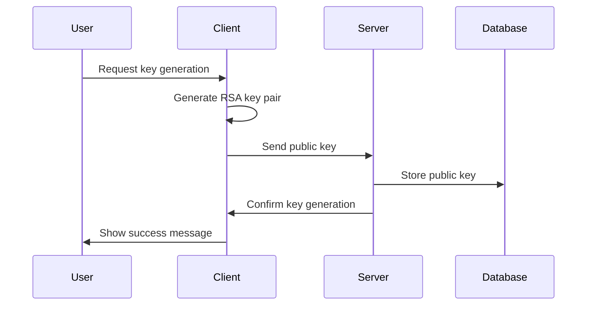
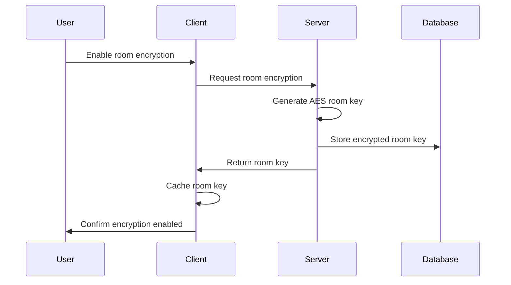
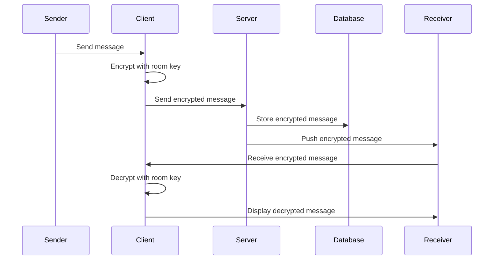

# End-to-End Encryption Implementation

## Overview

This document describes the implementation of end-to-end encryption (E2EE) for the Doc Available messaging system. The implementation provides secure, encrypted communication between users while maintaining backward compatibility with existing messages.

## Architecture

### Key Components

1. **Backend Encryption Service** (`backend/app/Services/EncryptionService.php`)
   - Handles server-side encryption operations
   - Manages key generation and storage
   - Provides encryption/decryption utilities

2. **Client-Side Encryption Service** (`services/encryptionService.ts`)
   - Handles client-side encryption using Web Crypto API
   - Manages key caching and import/export
   - Provides RSA and AES encryption capabilities

3. **Encryption API Service** (`services/encryptionApiService.ts`)
   - Manages communication with backend encryption endpoints
   - Handles key exchange and room encryption setup

4. **Encryption Hook** (`hooks/useEncryption.ts`)
   - React hook for managing encryption state
   - Provides encryption functionality throughout the app

5. **Encryption Controller** (`backend/app/Http/Controllers/EncryptionController.php`)
   - Handles encryption-related API requests
   - Manages user and room encryption setup

## Encryption Flow

### 1. User Key Generation



### 2. Room Encryption Setup



### 3. Message Encryption



## Security Features

### 1. AES-256-GCM Encryption
- **Algorithm**: AES-256-GCM (Galois/Counter Mode)
- **Key Size**: 256 bits
- **IV**: 12 bytes (randomly generated)
- **Authentication**: Built-in GCM authentication tag
- **Purpose**: Message content encryption

### 2. RSA-4096 Key Pairs
- **Algorithm**: RSA-OAEP with SHA-256
- **Key Size**: 4096 bits
- **Purpose**: Key exchange and user authentication

### 3. Key Management
- **Room Keys**: AES-256 keys for each chat room
- **User Keys**: RSA key pairs for each user
- **Key Storage**: Encrypted storage on server, secure caching on client
- **Key Rotation**: Support for key rotation and updates

### 4. Forward Secrecy
- Each message uses a unique IV
- Room keys can be rotated independently
- Compromised keys don't affect past messages

## Database Schema Changes

### Chat Messages Table
```sql
ALTER TABLE chat_messages ADD COLUMN encrypted_content TEXT NULL;
ALTER TABLE chat_messages ADD COLUMN iv VARCHAR(64) NULL;
ALTER TABLE chat_messages ADD COLUMN tag VARCHAR(64) NULL;
ALTER TABLE chat_messages ADD COLUMN algorithm VARCHAR(32) NULL;
ALTER TABLE chat_messages ADD COLUMN is_encrypted BOOLEAN DEFAULT FALSE;
```

### Chat Rooms Table
```sql
ALTER TABLE chat_rooms ADD COLUMN encryption_key TEXT NULL;
ALTER TABLE chat_rooms ADD COLUMN encryption_enabled BOOLEAN DEFAULT FALSE;
```

### Users Table
```sql
ALTER TABLE users ADD COLUMN public_key TEXT NULL;
ALTER TABLE users ADD COLUMN private_key TEXT NULL;
ALTER TABLE users ADD COLUMN encryption_enabled BOOLEAN DEFAULT FALSE;
```

## API Endpoints

### Encryption Management
- `POST /api/encryption/generate-keys` - Generate user encryption keys
- `GET /api/encryption/status` - Get user encryption status

### Room Encryption
- `POST /api/encryption/rooms/{roomId}/enable` - Enable room encryption
- `GET /api/encryption/rooms/{roomId}/status` - Get room encryption status
- `GET /api/encryption/rooms/{roomId}/key` - Get room encryption key

### Message Decryption
- `POST /api/encryption/messages/{messageId}/decrypt` - Decrypt a message

## Client-Side Implementation

### Key Features
1. **Automatic Encryption**: Messages are automatically encrypted when room encryption is enabled
2. **Transparent Decryption**: Encrypted messages are automatically decrypted for display
3. **Key Caching**: Room keys are cached locally for performance
4. **Fallback Handling**: Graceful fallback to plain text if encryption fails
5. **User Interface**: Clear indicators for encrypted messages and rooms

### Usage Example
```typescript
import { useEncryption } from '../hooks/useEncryption';

function ChatComponent() {
  const { 
    encryptionStatus, 
    decryptMessage, 
    encryptMessage,
    enableRoomEncryption 
  } = useEncryption();

  const handleSendMessage = async (content: string) => {
    // Encrypt message if room encryption is enabled
    const encryptedData = await encryptMessage(content, roomId);
    
    // Send message with encryption data
    await sendMessage({
      content: encryptedData ? null : content,
      ...encryptedData,
      is_encrypted: !!encryptedData
    });
  };

  const handleReceiveMessage = async (message: any) => {
    // Decrypt message for display
    const decryptedContent = await decryptMessage(message, roomId);
    setMessages(prev => [...prev, { ...message, content: decryptedContent }]);
  };
}
```

## Security Considerations

### 1. Key Storage
- **Server**: Room keys encrypted with user-specific keys
- **Client**: Keys cached in memory, cleared on app close
- **Backup**: Keys not included in device backups

### 2. Key Exchange
- Room keys distributed securely to room participants
- Keys encrypted with user public keys for transmission
- Key verification through digital signatures

### 3. Message Integrity
- GCM authentication prevents message tampering
- IV uniqueness prevents replay attacks
- Message ordering maintained through timestamps

### 4. Privacy Protection
- Server cannot read encrypted message content
- Metadata (timestamps, sender) remains visible for functionality
- Optional metadata encryption for enhanced privacy

## Migration Strategy

### 1. Backward Compatibility
- Existing messages remain unencrypted
- New messages can be encrypted while preserving old ones
- Gradual migration to encryption

### 2. Mandatory Encryption
- Encryption is now mandatory for all new messages
- All chat rooms automatically have encryption enabled
- Users cannot disable encryption for security reasons

### 3. Room-Level Control
- Each chat room automatically has encryption enabled
- All messages in all rooms are encrypted by default
- No mixed encrypted/unencrypted rooms supported

## Performance Considerations

### 1. Encryption Overhead
- AES-GCM encryption: ~1-2ms per message
- RSA operations: ~10-50ms per key operation
- Caching reduces repeated operations

### 2. Storage Impact
- Encrypted messages: ~33% larger than plain text
- Key storage: Minimal impact
- Database indexes optimized for encrypted queries

### 3. Network Impact
- Encrypted payloads slightly larger
- Key exchange: One-time overhead per room
- Compression applied after encryption

## Monitoring and Logging

### 1. Security Events
- Key generation and rotation events
- Failed decryption attempts
- Unauthorized access attempts

### 2. Performance Metrics
- Encryption/decryption timing
- Key cache hit rates
- Memory usage for key storage

### 3. User Analytics
- Encryption adoption rates
- Feature usage patterns
- Error rates and user feedback

## Future Enhancements

### 1. Advanced Features
- Perfect forward secrecy with key rotation
- Group chat encryption with dynamic key management
- File encryption for attachments
- Voice/video call encryption

### 2. Compliance Features
- Audit trails for encrypted communications
- Compliance reporting for healthcare regulations
- Data retention policies for encrypted data

### 3. User Experience
- Simplified key management
- Automatic key backup and recovery
- Cross-device key synchronization

## Testing Strategy

### 1. Unit Tests
- Encryption/decryption functionality
- Key generation and management
- Error handling and edge cases

### 2. Integration Tests
- End-to-end message encryption
- Key exchange protocols
- API endpoint functionality

### 3. Security Tests
- Penetration testing of encryption implementation
- Key management security
- Message integrity verification

### 4. Performance Tests
- Encryption throughput testing
- Memory usage profiling
- Network impact assessment

## Deployment Checklist

### 1. Database Migration
- [ ] Run encryption schema migrations
- [ ] Verify database indexes and constraints
- [ ] Test migration rollback procedures

### 2. Backend Deployment
- [ ] Deploy encryption service and controller
- [ ] Update API routes and middleware
- [ ] Configure encryption environment variables

### 3. Frontend Deployment
- [ ] Deploy encryption services and hooks
- [ ] Update chat components for encryption
- [ ] Test encryption UI components

### 4. Security Verification
- [ ] Verify encryption key generation
- [ ] Test message encryption/decryption
- [ ] Validate key management security
- [ ] Confirm backward compatibility

## Troubleshooting

### Common Issues

1. **Decryption Failures**
   - Check room key availability
   - Verify message encryption format
   - Clear and regenerate keys if needed

2. **Performance Issues**
   - Monitor key cache usage
   - Check encryption timing metrics
   - Optimize key storage and retrieval

3. **User Experience Issues**
   - Ensure clear encryption status indicators
   - Provide helpful error messages
   - Maintain backward compatibility

### Debug Tools
- Encryption status indicators in UI
- Detailed error logging
- Performance monitoring dashboards
- Key management utilities

## Conclusion

This end-to-end encryption implementation provides robust security for the Doc Available messaging system while maintaining usability and performance. The modular design allows for easy maintenance and future enhancements, while the comprehensive testing and monitoring ensure reliable operation in production environments. 