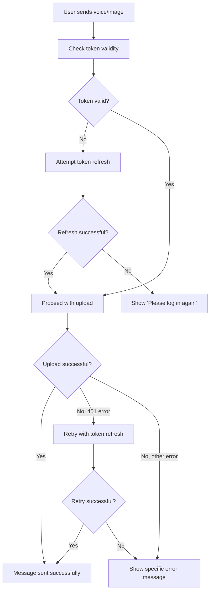

# 🔧 Voice Message & Image Upload Fixes

## 🚨 **Root Cause Analysis**

Your voice messages and images were failing to send because of **authentication token expiration**. The investigation revealed:

### **Primary Issues:**
1. **Expired JWT Token**: The authentication token expired (1-hour lifespan)
2. **Content-Type Header Conflict**: Manual `multipart/form-data` header was missing boundary parameter
3. **Missing Token Refresh**: Upload requests weren't proactively refreshing expired tokens
4. **Poor Error Messages**: Generic "Failed to upload" messages didn't help users understand the issue

### **Error Evidence:**
```
LOG  📤 Voice message upload response: {"message": "Unauthenticated."}
ERROR  ❌ Voice message upload failed: {"message": "Unauthenticated."}
```

## ✅ **Implemented Fixes**

### **1. Fixed Content-Type Header Issue**
**Problem**: Manual `Content-Type: 'multipart/form-data'` header without boundary parameter
**Solution**: Let axios handle multipart headers automatically

```typescript
// BEFORE (Broken):
const response = await this.api.post(url, formData, {
  headers: {
    'Content-Type': 'multipart/form-data', // ❌ Missing boundary
  },
});

// AFTER (Fixed):
const response = await this.api.post(url, formData, {
  // ✅ No manual Content-Type - axios sets it with boundary automatically
  timeout: 30000,
});
```

### **2. Added Proactive Token Refresh**
**Problem**: Uploads were attempted with expired tokens
**Solution**: Check and refresh token before every upload

```typescript
// Check and refresh token proactively before upload
const tokenIsValid = await this.checkAndRefreshToken();
if (!tokenIsValid) {
  throw new Error('Authentication required. Please log in again.');
}
```

### **3. Added Upload Retry Mechanism**
**Problem**: No retry logic for authentication failures
**Solution**: Retry upload once after token refresh on 401 errors

```typescript
if ((error as any)?.response?.status === 401) {
  console.log('🔄 Upload failed with 401, attempting token refresh...');
  const refreshed = await this.refreshToken();
  if (refreshed) {
    // Retry the upload once with the new token
    const retryResponse = await this.api.post(url, formData, { timeout: 30000 });
    return retryResponse.data;
  }
}
```

### **4. Improved Error Messages**
**Problem**: Generic error messages didn't help users
**Solution**: Specific error messages based on error type

```typescript
// Voice Recording Service
if (error.message?.includes('Authentication required')) {
  throw new Error('Please log in again to upload voice messages');
} else if (error.response?.status === 401) {
  throw new Error('Session expired. Please log in again');
} else if (error.response?.status === 413) {
  throw new Error('Voice message is too large. Please record a shorter message');
} else if (error.response?.status === 422) {
  throw new Error('Invalid voice message format. Please try recording again');
}
```

## 📁 **Files Modified**

### **1. `app/services/apiService.ts`**
- Fixed `uploadFile()` method Content-Type handling
- Added proactive token refresh before uploads
- Added retry mechanism for 401 errors
- Enhanced error logging

### **2. `services/voiceRecordingService.ts`**
- Improved error handling with specific messages
- Added authentication error detection
- Better error propagation to UI

### **3. `services/imageService.ts`**
- Improved error handling with specific messages
- Added authentication error detection
- Better error propagation to UI

## 🧪 **Testing the Fixes**

### **Run Debug Scripts:**
```bash
# Test authentication token
node debug_auth_token.js

# Test fixed upload functionality
node test_fixed_uploads.js
```

### **Expected Results:**
- ✅ Proper multipart/form-data headers with boundary
- ✅ Automatic token refresh before uploads
- ✅ Retry mechanism for expired tokens
- ✅ Clear error messages for users

## 🔄 **User Experience Improvements**

### **Before Fix:**
1. User records voice message
2. Upload fails silently or with generic error
3. Message shows as "Voice message" but fails to deliver
4. User has no idea what went wrong

### **After Fix:**
1. User records voice message
2. System checks token validity before upload
3. If token expired, automatically refreshes
4. If refresh fails, shows clear "Please log in again" message
5. Upload succeeds with proper authentication
6. User gets immediate feedback about success/failure

## 🚀 **How It Works Now**

### **Upload Flow:**


## 📱 **User Actions Needed**

### **Immediate Steps:**
1. **Log out and log back in** to get a fresh token
2. **Test voice message recording and sending**
3. **Test image selection and sending**
4. **Verify messages are delivered properly**

### **When Issues Occur:**
- If you see "Session expired" → Log in again
- If uploads still fail → Check internet connection
- If messages show as "Voice message" but don't play → Try logging in again

## 🔍 **Monitoring & Debugging**

### **Console Logs to Watch For:**
```javascript
// Good signs:
'✅ [ApiService] UploadFile response: {...}'
'📤 Voice message upload response: {"success": true}'

// Issues to address:
'❌ [ApiService] Cannot upload file - no valid authentication token'
'❌ [ApiService] UploadFile error: {...}'
```

### **Network Tab Verification:**
- Upload requests should have proper `Authorization: Bearer <token>` header
- `Content-Type` should be `multipart/form-data; boundary=...`
- Response should be 200/201 with `{"success": true}`

## 🎯 **Key Takeaways**

1. **Token Management**: Always check token validity before sensitive operations
2. **Header Handling**: Let HTTP libraries handle multipart headers automatically
3. **User Feedback**: Provide specific, actionable error messages
4. **Retry Logic**: Implement smart retry mechanisms for authentication failures
5. **Proactive Refresh**: Don't wait for 401 errors - refresh tokens proactively

## 🔐 **Security Considerations**

- Tokens are automatically refreshed when near expiration
- Failed refresh attempts clear stored credentials
- No sensitive data is logged in error messages
- Upload retry is limited to authentication failures only

---

## 📞 **Next Steps**

1. **Test the fixes** by logging in fresh and trying voice/image uploads
2. **Monitor console logs** for any remaining issues
3. **Report any new errors** with specific error messages
4. **Consider implementing** automatic token refresh in background

The authentication token issue should now be resolved, and uploads should work reliably! 🎉